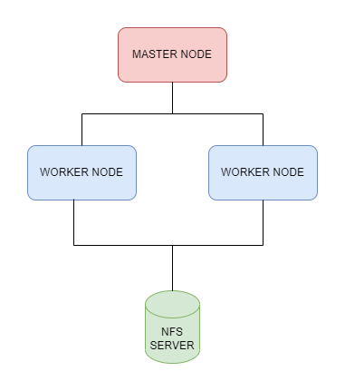
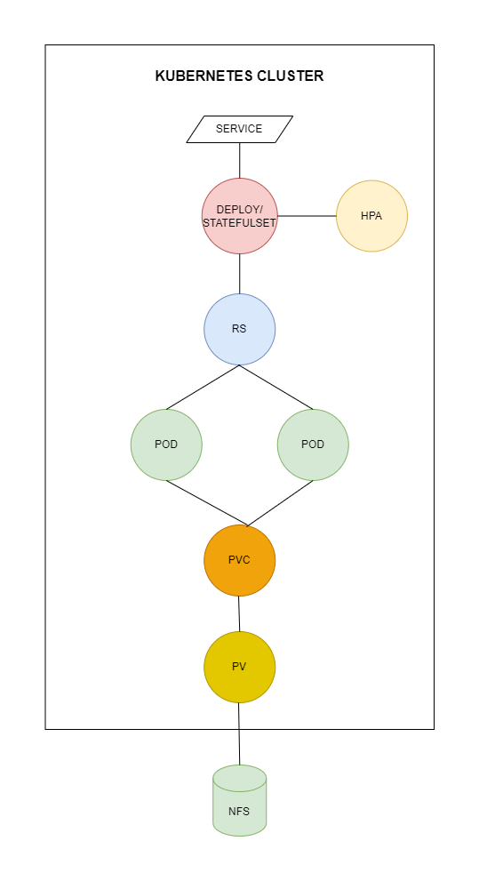

# Terraform Kubernetes

in this repo i create 1 kubernetes master node and 2 worker node like following diagram


you can customize the node by configuring ``kind-config.yaml``
## Create Cluster
```
kind create cluster --name=<cluster-name> --config=kind-config.yaml
```

## Configure Metric Server & Dashboard

```
kubectl create -f metrics-server.yaml
kubectl create -f dashboard.yaml
kubectl create -f admin-user.yaml
kubectl create -f cluster-role-binding.yaml
```

start kubectl proxy with this command
```
kubectl proxy
```
after that you can open kubernetes dashboard with following url [http://localhost:8001/api/v1/namespaces/kubernetes-dashboard/services/https:kubernetes-dashboard:/proxy/](http://localhost:8001/api/v1/namespaces/kubernetes-dashboard/services/https:kubernetes-dashboard:/proxy/)

use this command to generate new token
```
kubectl -n kubernetes-dashboard create token admin-user
``` 

## Apply Configuration

before deep down to terraform, we need to configure certificate for authenticate terraform to kubernetes master. type this command to get the certificate
```
kubectl config view --context=<cluster-name> --flatten --minify
```
open ``terraform.tfvars`` and put the given certificate

- certificate-authority-data > cluster_ca_certificate
- server > host
- client-certificate-data > cluster_ca_certificate
- client-key-data > client_key

in this repo i create 1 deployment (stateles app), and 1 stateful app that mount to NFS storage. look diagram below for further details



cd to kubernetes directory, init terraform dependency by typing command
```
terraform init
```

to see terraform configuration, you can use this command
```
terraform plan
```

type this command to apply terraform configuration
```
terraform apply
```

use this command to destroy applied terraform resources
```
terraform destroy
```